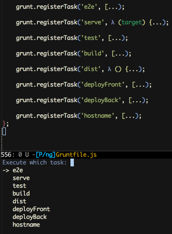

# grunt.el [](https://travis-ci.org/gempesaw/grunt.el) [](http://melpa.org/#/grunt) [](http://stable.melpa.org/#/grunt)

[Grunt][] is a renowned JavaScript task runner. This package provides
a way to invoke grunt tasks without needing a separate shell or buffer
management per task or project.



## installation

Use MELPA: `M-x package-install <RET> grunt <RET>`. Or, get `grunt.el`
in your load-path and do a `(require 'grunt)`.

## usage

Figure out what keybinding you'd like to bind `grunt-exec` to, or just
invoke it via `M-x` while your current buffer is in a repo with a
Gruntfile somewhere.

```elisp
;; I'm currently experimenting with "C-M-g"
(global-set-key (kbd "C-M-g") 'grunt-exec)
```

It'll try to find a Gruntfile by traversing upwards from your current
working directory, or bail out if it can't find one. Upon finding a
Gruntfile, `grunt.el` will shell out to execute `grunt --help` and
parse the available tasks from its output, suggesting the tasks it
finds there.

You can also enter in any valid Grunt task at the prompt.

After invoking a grunt task, we'll pop a window and buffer for
you. While in that window, you have the following keybinds:

- <kbd>q</kbd>: invoke `(quit-window)`, quitting the current window
  and burying its buffer. Note that since the buffer is buried and not
  killed, the grunt task will still continue running. For example, you
  could <kbd>q</kbd> away a long running window like `grunt watch`.

- <kbd>g</kbd>: rerun the most recently run Grunt task. Note that this
  is _not_ necessarily the task in the current window! That is, if you
  run `grunt FIRST_TASK` and then `grunt SECOND_TASK`, then go to the
  buffer for `FIRST_TASK` and hit <kbd>g</kbd>, it will rerun
  `SECOND_TASK`, since it's the _most recent_ task.

### breaking changes

- **v1.1.0**: If you happened to install this specific 1.1.0 version
  during the short period it was available, we may have accidentally
  overriden your <kbd>q</kbd> key in all shells to
  `(quit-window)`. This is obviously undesirable; execute the
  following elisp when in a shell via <kbd>C-x C-e</kbd> or
  <kbd>M-:</kbd> to restore functionality. Sorry 'bout that one! This
  bug is fixed in v1.1.1 and newer.

  ```elisp
  (local-set-key (kbd "q") 'self-insert-command)
  ```

- **v1.0.0**: We now default to using `grunt --help` to establish our
  task list. This is _not_ the same behavior as in previous versions;
  see <kbd>C-h v</kbd> `grunt-show-all-tasks` for more
  information. For the old behavior,

  ```elisp
  (setq grunt-show-all-tasks nil)
  ```

- **v0.0.3**: If you have a long running task like `serve` or `watch`,
  you can re-run it from `grunt-exec` and we'll automatically kill
  your existing process buffer before starting a new process. This is
  not the same behavior as in previous versions; see <kbd>C-h v</kbd>
  `grunt-kill-existing-buffer` for more information. For the old
  behavior,

  ```elisp
  (setq grunt-kill-existing-buffer nil)
  ```

## development

To run tests, use [Cask][]:

    $ cask install
    $ cask exec ert-runner

In addition to `grunt.el`'s dependency on `dash.el`, running tests
requires `f.el` and `noflet.el`; `cask install` handles that for you.

[Grunt]: http://gruntjs.com/
[Cask]: http://cask.github.io/
